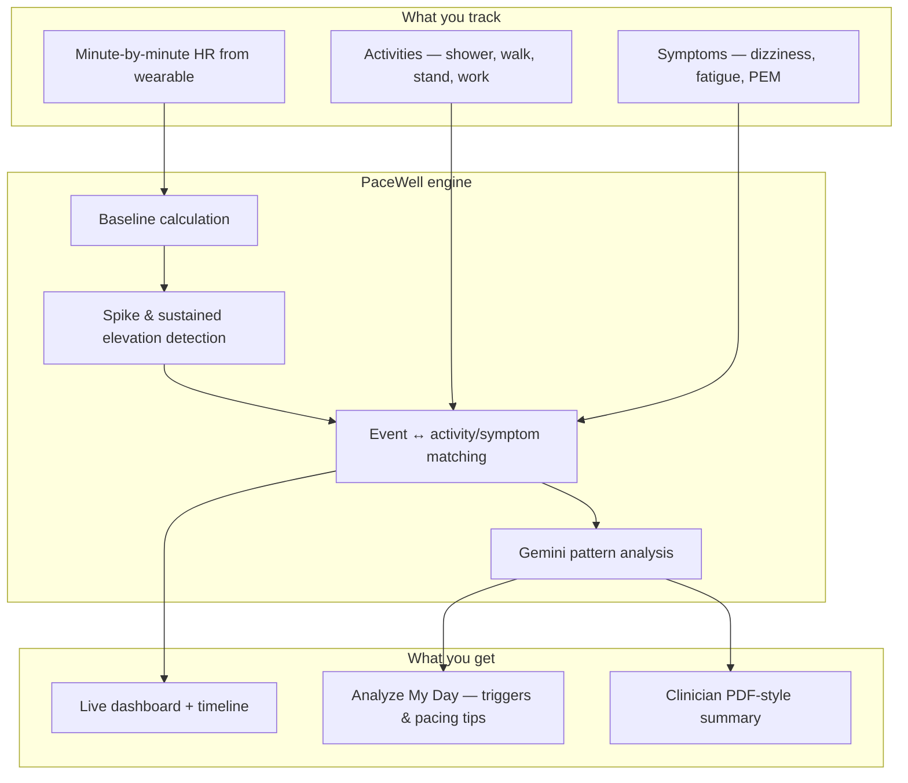
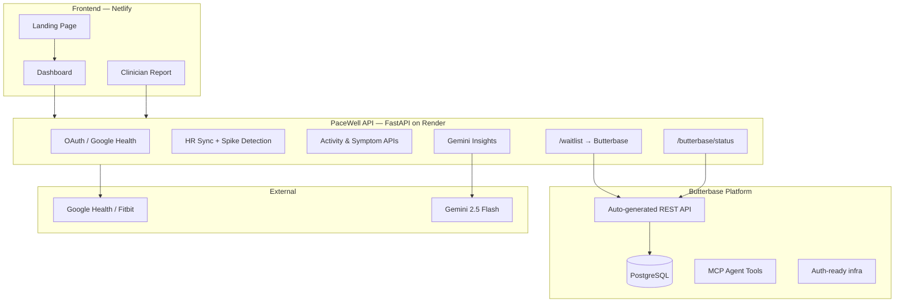
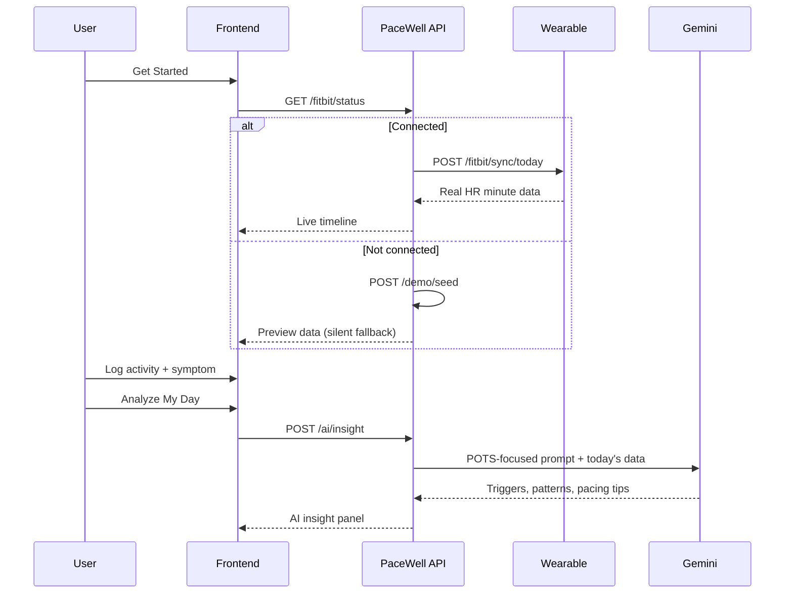
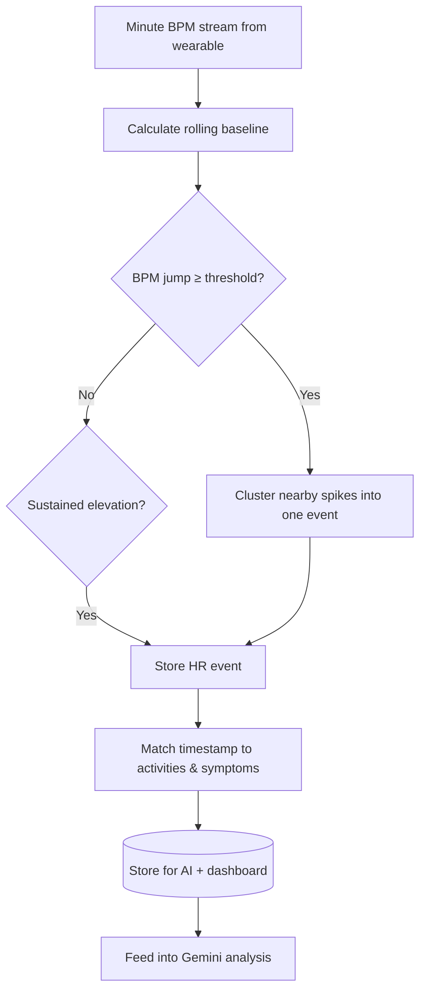

<p align="center">
  <strong>PaceWell</strong><br/>
  <em>Understand your heart rate. Prevent crashes. Pace your day with confidence.</em>
</p>

<p align="center">
  <a href="https://butterbase.ai"><strong>Powered by Butterbase</strong></a> ·
  <a href="https://www.netlify.com">Netlify</a> ·
  <a href="https://render.com">Render</a> ·
  <a href="https://github.com/yordanoskassa/pacewell">GitHub</a>
</p>

---

## What is PaceWell?

**PaceWell** is a heart-rate monitoring web app built for people living with **POTS** (Postural Orthostatic Tachycardia Syndrome), **dysautonomia**, **Long COVID**, **ME/CFS**, and other conditions where tachycardia and energy crashes are part of daily life.

Standing up, showering, walking upstairs, or even eating can spike your heart rate and trigger dizziness, brain fog, fatigue, or post-exertional malaise. The hard part is not just *feeling* bad — it is figuring out **what caused it** and **how to pace yourself** before the next crash.

PaceWell connects three things that are usually scattered across different apps:

1. **Wearable heart-rate data** (Google Health / Fitbit)
2. **Activity logging** (what you were doing when HR rose)
3. **Symptom logging** (how you felt before and after)

It then runs **Gemini AI** analysis to surface triggers, patterns, and pacing guidance — plus **clinician-ready reports** you can share with your care team.

> **Backend powered by [Butterbase](https://butterbase.ai)** — PaceWell uses Butterbase as its production backend platform for persistent data (waitlist, user onboarding, and future Postgres-backed health records). The FastAPI layer handles health-domain logic (HR spike detection, wearable OAuth, AI prompts) while Butterbase provides managed Postgres, auto-generated REST APIs, auth-ready infrastructure, and MCP tooling so we could ship a full-stack hackathon project in days — not weeks.

---

## Table of Contents

- [The Problem](#the-problem)
- [How PaceWell Helps](#how-pacewell-helps)
- [Architecture](#architecture)
- [Butterbase Integration](#butterbase-integration)
- [Data Flow](#data-flow)
- [Features](#features)
- [Tech Stack](#tech-stack)
- [Getting Started](#getting-started)
- [Butterbase Setup (Hackathon)](#butterbase-setup-hackathon)
- [Environment Variables](#environment-variables)
- [Deployment](#deployment)
- [API Reference](#api-reference)
- [Project Structure](#project-structure)
- [Roadmap](#roadmap)
- [Disclaimer](#disclaimer)

---

## The Problem

People with dysautonomia often experience:

| Symptom / challenge | Why it is hard to manage |
|---------------------|--------------------------|
| Sudden HR spikes (120–160+ bpm) | Spikes feel random without continuous data |
| Post-exertional crashes | Delayed crashes make cause-and-effect unclear |
| Activity intolerance | Safe limits differ day to day |
| Doctor visits | Hard to summarize weeks of symptoms from memory |

Consumer fitness apps show heart rate. They do not connect HR spikes to **your shower**, **standing in line**, or **brain fog two hours later**. PaceWell is built specifically for that connection.

---

## How PaceWell Helps



**Example user flow:**

1. Land on the minimal homepage → **Get Started** (name optional)
2. Dashboard tries **Fitbit / Google Health sync** first
3. If not connected, loads **preview demo data** so the UI is never empty
4. User logs “stood up quickly” at 9:15 AM, symptom “dizzy” at 9:20 AM
5. Spike detector flags HR jump 78 → 132 bpm at 9:14 AM
6. **Analyze My Day** sends context to Gemini → returns likely trigger + pacing advice
7. **Clinician Report** exports a date-range summary for a cardiology or autonomic clinic visit

---

## Architecture

PaceWell is a **React SPA** on Netlify talking to a **FastAPI** service on Render. **Butterbase** is the backend platform layer for durable Postgres storage and auto-generated REST endpoints.



### Why this split?

| Layer | Responsibility |
|-------|----------------|
| **React frontend** | UX, charts, logging forms, AI panel |
| **FastAPI** | Wearable OAuth, HR algorithms, Gemini prompts, CORS |
| **Butterbase** | Postgres persistence, waitlist storage, schema via MCP, exportable REST |
| **In-memory store** | Session health data when Butterbase tables are not yet wired (demo / hackathon speed) |

This lets us **demo live** without provisioning MongoDB, while still showing a **real Butterbase API call** for waitlist signups — exactly what hackathon judges look for.

---

## Butterbase Integration

PaceWell integrates with Butterbase through its **[REST Data API](https://docs.butterbase.ai/sdks-and-tools/rest-api/)**. No ORM boilerplate — create a table in Butterbase, get CRUD endpoints automatically.

### What we store in Butterbase

| Table | Purpose |
|-------|---------|
| `waitlist_entries` | Early-access email signups from landing / marketing |

Schema reference: [`backend/butterbase_schema.json`](backend/butterbase_schema.json)

### Live API endpoints using Butterbase

| Method | Endpoint | Description |
|--------|----------|-------------|
| `POST` | `/waitlist` | Insert signup into Butterbase `waitlist_entries` |
| `GET` | `/waitlist` | List recent signups from Butterbase |
| `GET` | `/butterbase/status` | Connection + schema health check |
| `GET` | `/health` | App health including Butterbase connectivity |

### Example: join the waitlist (Butterbase-backed)

```bash
curl -X POST https://pacewell.onrender.com/waitlist \
  -H "Content-Type: application/json" \
  -d '{
    "email": "you@example.com",
    "name": "Alex",
    "conditions": ["POTS", "Long COVID"],
    "source": "hackathon-demo"
  }'
```

**Response (Butterbase configured):**

```json
{
  "status": "created",
  "storage": "butterbase",
  "id": "uuid-from-postgres",
  "email": "you@example.com"
}
```

**Response (local demo, no Butterbase env vars):**

```json
{
  "status": "created",
  "storage": "memory",
  "id": "...",
  "email": "you@example.com"
}
```

### Example: check Butterbase connection

```bash
curl https://pacewell.onrender.com/butterbase/status
```

```json
{
  "platform": "Butterbase",
  "docs": "https://docs.butterbase.ai",
  "configured": true,
  "connected": true,
  "app_id": "app_abc123",
  "tables": ["waitlist_entries"]
}
```

### Implementation

The integration lives in:

- [`backend/app/services/butterbase_service.py`](backend/app/services/butterbase_service.py) — async HTTP client for Butterbase REST
- [`backend/app/routes/waitlist.py`](backend/app/routes/waitlist.py) — waitlist CRUD via Butterbase
- [`backend/app/routes/butterbase.py`](backend/app/routes/butterbase.py) — platform status endpoint

Butterbase docs: [getting started](https://docs.butterbase.ai/getting-started/introduction/) · [REST API](https://docs.butterbase.ai/sdks-and-tools/rest-api/) · [GitHub](https://github.com/butterbase-ai/butterbase)

---

## Data Flow

### Connect-first dashboard init



### Spike detection pipeline



**Detection rules (simplified):**

- **Spike event** — sudden jump above baseline + absolute threshold
- **Sustained elevation** — HR stays elevated for N consecutive minutes
- **Matching** — activities/symptoms within a time window before/after each event

---

## Features

### Landing (`/`)

Minimal full-screen hero with background video, POTS-focused headline, optional name field, and **Get Started** that always navigates to the dashboard.

### Dashboard (`/dashboard`)

- Heart-rate timeline (Recharts) with baseline reference line
- Hourly HR distribution bar chart
- Spike event cards with severity
- Activity logger (type, time, intensity, notes)
- Symptom logger (type, severity 1–10, duration)
- **Analyze My Day** — comprehensive Gemini panel with triggers, patterns, and pacing guidance
- Connect / sync Fitbit banner
- Silent demo fallback when wearable is not connected

### Clinician Report (`/report`)

- Pick a date range
- Generate summary with HR stats, events, logged activities/symptoms
- AI-written narrative suitable for sharing with a doctor

### Butterbase waitlist API

- `POST /waitlist` for early-access capture
- Persists to Butterbase Postgres in production
- In-memory fallback for local development without credentials

---

## Tech Stack

| Layer | Technology |
|-------|------------|
| **Backend platform** | [**Butterbase**](https://butterbase.ai) — Postgres + auto REST + MCP |
| **Application API** | Python 3.11, FastAPI, Uvicorn, httpx |
| **Session / demo data** | In-memory document store (resets on restart) |
| **Frontend** | React 19, TypeScript, Vite |
| **Styling** | Tailwind CSS v4, glassmorphism dark theme |
| **Charts** | Recharts |
| **AI** | Google Gemini 2.5 Flash |
| **Wearables** | Google Health / Fitbit OAuth |
| **Frontend hosting** | Netlify |
| **API hosting** | Render |

---

## Getting Started

### Prerequisites

- Node.js 20+
- Python 3.11+
- [Butterbase](https://butterbase.ai) account (for persistent waitlist storage)
- Google Cloud OAuth credentials (for Fitbit / Google Health)
- Gemini API key

### 1. Clone the repo

```bash
git clone https://github.com/yordanoskassa/pacewell.git
cd pacewell
```

### 2. Backend

```bash
cd backend
python3 -m venv .venv
source .venv/bin/activate   # Windows: .venv\Scripts\activate
pip install -r requirements.txt
cp .env.example .env        # fill in keys (see below)
uvicorn app.main:app --reload --port 8000
```

API docs: http://localhost:8000/docs

### 3. Frontend

```bash
cd frontend
npm install
npm run dev
```

App: http://localhost:5173

Set `VITE_API_URL=http://localhost:8000` in `frontend/.env` if not using the default Render URL.

---

## Butterbase Setup (Hackathon)

We used Butterbase MCP inside Cursor to provision the backend in minutes. You can also set it up manually.

### Option A — MCP (recommended for AI-assisted builds)

1. Create an app at [butterbase.ai](https://butterbase.ai)
2. Add Butterbase to your MCP config: [MCP setup guide](https://docs.butterbase.ai/getting-started/mcp-setup/)
3. Ask your agent: *"Apply the schema in `backend/butterbase_schema.json`"*
4. Copy your `app_id` and service API key (`bb_sk_...`) into `.env`

### Option B — Manual schema

Apply this table via the Butterbase dashboard or schema API:

```json
{
  "tables": [
    {
      "name": "waitlist_entries",
      "columns": [
        { "name": "email", "type": "text", "nullable": false, "unique": true },
        { "name": "name", "type": "text" },
        { "name": "conditions", "type": "text[]" },
        { "name": "source", "type": "text", "default": "landing" },
        { "name": "created_at", "type": "timestamptz", "default": "now()" }
      ]
    }
  ]
}
```

Butterbase instantly exposes:

```
POST   /v1/{app_id}/waitlist_entries
GET    /v1/{app_id}/waitlist_entries
PATCH  /v1/{app_id}/waitlist_entries/{id}
DELETE /v1/{app_id}/waitlist_entries/{id}
```

PaceWell's `/waitlist` route wraps this with validation and hackathon-friendly fallbacks.

### Verify

```bash
# Butterbase platform status
curl http://localhost:8000/butterbase/status

# Test waitlist write
curl -X POST http://localhost:8000/waitlist \
  -H "Content-Type: application/json" \
  -d '{"email":"test@example.com","name":"Demo User"}'
```

---

## Environment Variables

### Backend (`backend/.env`)

| Variable | Required | Description |
|----------|----------|-------------|
| `BUTTERBASE_APP_ID` | For production persistence | Your Butterbase app ID (`app_...`) |
| `BUTTERBASE_API_URL` | No | Default `https://api.butterbase.ai` |
| `BUTTERBASE_API_KEY` | Recommended | Service key (`bb_sk_...`) for server-side writes |
| `GEMINI_API_KEY` | Yes (for AI) | Google AI Studio key |
| `GEMINI_MODEL` | No | Default `gemini-2.5-flash` |
| `GOOGLE_CLIENT_ID` | For wearable sync | Google OAuth client ID |
| `GOOGLE_CLIENT_SECRET` | For wearable sync | Google OAuth secret |
| `GOOGLE_REDIRECT_URI` | For wearable sync | e.g. `https://pacewell.onrender.com/auth/fitbit/callback` |
| `FERNET_KEY` | For token encryption | Generate with `python -c "from cryptography.fernet import Fernet; print(Fernet.generate_key().decode())"` |
| `FRONTEND_URL` | Yes | Netlify URL for OAuth redirects + CORS |

### Frontend (`frontend/.env`)

| Variable | Description |
|----------|-------------|
| `VITE_API_URL` | Backend URL, e.g. `https://pacewell.onrender.com` |

---

## Deployment

### Frontend — Netlify

`netlify.toml` is preconfigured:

```toml
[build]
  base = "frontend"
  command = "npm run build"
  publish = "dist"
```

1. Connect GitHub repo in Netlify
2. Set `VITE_API_URL=https://your-api.onrender.com`
3. Deploy

### Backend — Render

Use the included [`render.yaml`](render.yaml) blueprint **or** create a manual Web Service:

| Setting | Value |
|---------|-------|
| **Root Directory** | `backend` |
| **Build Command** | `pip install -r requirements.txt` |
| **Start Command** | `uvicorn app.main:app --host 0.0.0.0 --port $PORT` |
| **Python Version** | `3.11.9` |

See [`backend/RENDER.md`](backend/RENDER.md) for step-by-step Render setup.

> **Important:** Set Root Directory to `backend`. Building from repo root causes `requirements.txt not found`.

### Google OAuth

Add your Render callback URL in [Google Cloud Console](https://console.cloud.google.com/):

```
https://YOUR-SERVICE.onrender.com/auth/fitbit/callback
```

---

## API Reference

### Health & platform

| Method | Path | Description |
|--------|------|-------------|
| GET | `/` | App info + Butterbase link |
| GET | `/health` | Liveness + Butterbase connectivity |
| GET | `/butterbase/status` | Butterbase schema / connection details |

### Butterbase-backed

| Method | Path | Description |
|--------|------|-------------|
| POST | `/waitlist` | Join early-access waitlist → Butterbase `waitlist_entries` |
| GET | `/waitlist` | List waitlist entries |

### Wearables

| Method | Path | Description |
|--------|------|-------------|
| GET | `/auth/fitbit/start` | Start Google Health OAuth |
| GET | `/auth/fitbit/callback` | OAuth callback |
| GET | `/fitbit/status` | Connection + demo mode flag |
| POST | `/fitbit/sync/today` | Sync today's HR from wearable |

### Heart rate

| Method | Path | Description |
|--------|------|-------------|
| GET | `/heart-rate/today` | Minute-level BPM points + baseline |
| GET | `/heart-rate/events/today` | Detected spike / sustained events |

### Logging

| Method | Path | Description |
|--------|------|-------------|
| POST | `/activities` | Log an activity |
| GET | `/activities` | List activities (optional `date` filter) |
| DELETE | `/activities/{id}` | Remove activity |
| POST | `/symptoms` | Log a symptom |
| GET | `/symptoms` | List symptoms |
| DELETE | `/symptoms/{id}` | Remove symptom |

### AI & reports

| Method | Path | Description |
|--------|------|-------------|
| POST | `/ai/insight` | Gemini analysis for a day |
| GET | `/ai/insights` | Past insights |
| POST | `/reports/generate` | Clinician report for date range |
| GET | `/reports` | List reports |
| GET | `/reports/{id}` | Single report |

### Demo

| Method | Path | Description |
|--------|------|-------------|
| POST | `/demo/seed` | Seed realistic preview HR + events |

Interactive docs: `http://localhost:8000/docs`

---

## Project Structure

```
pacewell/
├── frontend/
│   ├── src/
│   │   ├── pages/
│   │   │   ├── Landing.tsx       # Minimal hero + Get Started
│   │   │   ├── Dashboard.tsx     # HR charts, logging, AI panel
│   │   │   └── ClinicianReport.tsx
│   │   ├── components/           # Charts, loggers, AI panel
│   │   └── api/client.ts         # Axios API client
│   └── netlify.toml              # (via root netlify.toml)
├── backend/
│   ├── app/
│   │   ├── main.py               # FastAPI entry + /health
│   │   ├── services/
│   │   │   ├── butterbase_service.py  # ★ Butterbase REST client
│   │   │   ├── gemini_service.py      # AI prompts
│   │   │   ├── hr_detection.py        # Spike detection
│   │   │   └── fitbit_service.py      # Wearable OAuth
│   │   ├── routes/
│   │   │   ├── waitlist.py       # ★ Butterbase-backed waitlist
│   │   │   ├── butterbase.py     # ★ Platform status
│   │   │   ├── heart_rate.py
│   │   │   ├── activities.py
│   │   │   ├── symptoms.py
│   │   │   ├── ai.py
│   │   │   └── reports.py
│   │   ├── memory_store.py       # In-memory demo store
│   │   └── database.py
│   ├── butterbase_schema.json    # Schema to apply in Butterbase
│   └── requirements.txt
├── render.yaml                   # Render blueprint
├── netlify.toml
└── README.md
```

---

## Roadmap

- [ ] Migrate activity/symptom/HR history from in-memory → Butterbase Postgres tables
- [ ] Butterbase Auth for multi-device user sessions
- [ ] Butterbase file storage for exported clinician PDFs
- [ ] Apple HealthKit bridge (native iOS companion)
- [ ] Push notifications when HR crosses personal threshold

---

## Disclaimer

**PaceWell is not a medical device.** It does not diagnose, treat, or prevent any condition. Heart-rate thresholds, AI insights, and reports are informational pattern summaries only. Always work with your cardiologist, neurologist, or autonomic specialist for clinical decisions.

---

<p align="center">
  Built for the dysautonomia community at a hackathon ·
  <a href="https://butterbase.ai"><strong>Powered by Butterbase</strong></a>
</p>
